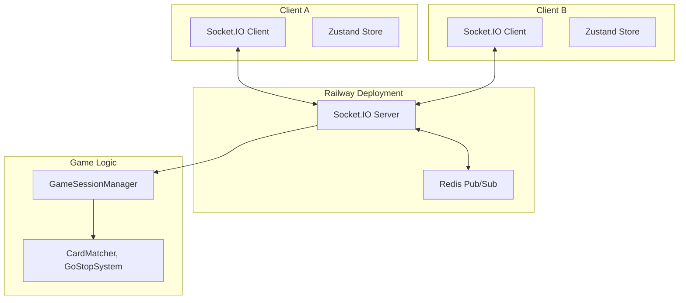
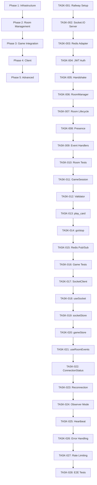

# SPEC-NET-001: Execution Strategy

**Strategist:** manager-strategy agent
**Analysis Date:** 2026-03-02
**Methodology:** Philosopher Framework + SDD 2025 Task Decomposition

---

## 1. Executive Summary

### 1.1 Plan Overview

SPEC-NET-001 implements WebSocket-based real-time multiplayer communication for the Say Mat-go Reboot card game. This execution strategy provides a phased approach with 28 atomic tasks across 5 implementation phases.

**Selected Architecture:** Railway + Redis Pub/Sub (Balanced Approach)
- Single deployment platform with built-in Redis
- Multi-instance scalability from day one
- Production-ready with moderate implementation complexity

### 1.2 Strategic Decision Summary

**Decision Point 1: Deployment Platform**
| Option | Score | Rationale |
|--------|-------|-----------|
| Railway + Redis | **7.75/10** | Selected: Built-in Redis, simple deployment, production-ready |
| Railway + In-Memory | 7.05/10 | Fallback: Simpler but requires migration later |
| Fly.io Global | 6.50/10 | Alternative: Best global performance but complex setup |

**Decision Point 2: WebSocket Library**
- **Selected:** Socket.IO 4.7.0
- **Rationale:** Built-in reconnection, room management, Redis adapter, TypeScript support

### 1.3 Effort Estimate

| Metric | Value |
|--------|-------|
| Complexity | High (greenfield networking layer) |
| Estimated Duration | 3-4 weeks |
| Total Tasks | 28 atomic tasks |
| Dependencies | None (standalone SPEC) |
| Risk Level | Medium (new architecture, proven technologies) |

---

## 2. Requirements Summary

### 2.1 Functional Requirements

**Connection Management (FR-CM-001 to FR-CM-005)**
- Socket.IO server implementation
- Automatic reconnection
- JWT authentication on handshake
- Heartbeat monitoring
- Error code handling

**Room Management (FR-RM-001 to FR-RM-006)**
- Unique room ID creation
- Room join/leave functionality
- Room state tracking (waiting/playing/finished)
- Empty room auto-deletion
- 2 players + unlimited observers

**Game State Synchronization (FR-GS-001 to FR-GS-004)**
- Real-time state broadcasting
- Immutable state updates
- Card play, Go/Stop synchronization
- Retry mechanism for failed updates

### 2.2 Non-Functional Requirements

**Performance (NFR-P-001 to NFR-P-004)**
- State update latency: < 100ms (P95)
- Connection establishment: < 500ms
- Message propagation: < 50ms (within room)
- Concurrent sessions: 100+

**Security (NFR-SEC-001 to NFR-SEC-003)**
- JWT token validation
- Player action verification
- State access control

### 2.3 EARS Requirements Mapping

| Category | Count | Key Examples |
|----------|-------|--------------|
| Ubiquitous | 4 | JWT verification, server validation, logging, error messages |
| Event-Driven | 8 | join_room, play_card, declare_go, declare_stop, disconnect |
| State-Driven | 5 | 2-player auto-start, turn validation, reconnection timeout |
| Unwanted | 4 | No unauthorized changes, hidden cards, room limits |
| Optional | 3 | Replay, chat, unlimited observers |

---

## 3. Architecture Decision

### 3.1 Selected Architecture: Railway + Redis Pub/Sub



### 3.2 Technology Stack

| Component | Technology | Version | Purpose |
|-----------|-----------|---------|---------|
| WebSocket Server | Socket.IO | 4.7.0 | Real-time bidirectional communication |
| WebSocket Client | socket.io-client | 4.7.0 | Browser WebSocket connection |
| State Management | Zustand | 4.4.0 | Client-side state with optimistic updates |
| Authentication | Supabase JWKS | - | JWT token validation |
| State Sync | Redis Pub/Sub | - | Cross-instance state broadcasting |
| Hosting | Railway | - | Docker container hosting |
| HTTP Server | Express | 4.x | Socket.IO HTTP server |

### 3.3 Library Versions with Rationale

```json
{
  "dependencies": {
    "socket.io": "^4.7.0",
    "socket.io-client": "^4.7.0",
    "@types/socket.io": "^3.0.2",
    "express": "^4.18.0",
    "ioredis": "^5.3.0",
    "jwks-rsa": "^3.0.0",
    "jsonwebtoken": "^9.0.0",
    "zustand": "^4.4.0",
    "zod": "^3.22.0"
  }
}
```

**Version Rationale:**
- **Socket.IO 4.7.0:** Latest stable with TypeScript improvements, Redis adapter built-in
- **ioredis 5.3.0:** Promise-based Redis client with Pub/Sub support
- **jwks-rsa 3.0.0:** Supabase JWKS endpoint validation
- **zustand 4.4.0:** Lightweight state management, React 18+ optimized
- **zod 3.22.0:** Runtime type validation for WebSocket events

---

## 4. Implementation Phases

### Phase 1: Infrastructure Foundation

**Goal:** Establish Railway deployment with working WebSocket server

**Tasks:**
- [ ] TASK-001: Set up Railway project with Dockerfile and railway.toml
- [ ] TASK-002: Initialize Socket.IO server with Express HTTP server
- [ ] TASK-003: Implement Redis connection and Socket.IO Redis adapter
- [ ] TASK-004: Create JWT authentication middleware with Supabase JWKS (@MX:ANCHOR)
- [ ] TASK-005: Implement connection handshake and error handling

**Success Criteria:**
- Railway server accessible via WebSocket URL
- JWT authentication working
- Ping/pong heartbeat functional
- Connection error handling operational

**Deliverables:**
- `Dockerfile`, `railway.toml`
- `server/index.ts` - Socket.IO server entry point
- `lib/websocket/server/auth.ts` - JWT middleware (@MX:ANCHOR)
- `lib/websocket/server/redis.ts` - Redis adapter

---

### Phase 2: Room Management Core

**Goal:** Enable players to create, join, and leave rooms

**Tasks:**
- [ ] TASK-006: Implement RoomManager class with Map-based storage
- [ ] TASK-007: Create room lifecycle methods (create/join/leave/destroy)
- [ ] TASK-008: Implement player presence tracking and cleanup
- [ ] TASK-009: Add basic event handlers for join_room/leave_room
- [ ] TASK-010: Write room management unit tests

**Success Criteria:**
- Players can create rooms with unique IDs
- Players can join existing rooms
- Player presence tracked correctly
- Empty rooms auto-delete after 30 seconds
- Events broadcast to all room participants

**Deliverables:**
- `lib/websocket/server/rooms.ts` - RoomManager class
- `lib/websocket/server/connection.ts` - Connection manager
- `lib/websocket/server/events.ts` - Event handlers
- `lib/websocket/server/rooms.test.ts` - Unit tests

---

### Phase 3: Game State Integration

**Goal:** Integrate game logic with real-time state synchronization

**Tasks:**
- [ ] TASK-011: Create GameSessionManager linking rooms to game state
- [ ] TASK-012: Integrate CardMatcher for move validation
- [ ] TASK-013: Implement play_card event handler with server validation
- [ ] TASK-014: Implement declare_go/declare_stop event handlers
- [ ] TASK-015: Add Redis Pub/Sub for cross-instance state broadcasting
- [ ] TASK-016: Write game state integration tests

**Success Criteria:**
- Card plays validated and synchronized
- Go/Stop declarations update state correctly
- Turn order enforced on server
- State updates broadcast to all players
- Redis Pub/Sub enables multi-instance sync

**Deliverables:**
- `lib/websocket/server/gameSession.ts` - Game session manager
- `lib/websocket/server/validator.ts` - Move validation
- `lib/websocket/server/batching.ts` - Message batching (50ms window)
- `lib/websocket/server/gameSession.test.ts` - Integration tests

---

### Phase 4: Client-Side Implementation

**Goal:** Build WebSocket client with React integration

**Tasks:**
- [ ] TASK-017: Implement SocketClient singleton with reconnection
- [ ] TASK-018: Create useSocket React hook for connection management
- [ ] TASK-019: Create socketStore Zustand store for connection state
- [ ] TASK-020: Create gameStore Zustand store with optimistic updates
- [ ] TASK-021: Implement useRoomEvents hook for game event handling
- [ ] TASK-022: Create ConnectionStatus React component

**Success Criteria:**
- Singleton SocketClient instance
- Automatic reconnection with exponential backoff
- Connection state visible in UI
- Game state updates trigger re-renders
- Optimistic UI updates for responsiveness

**Deliverables:**
- `lib/websocket/client/SocketClient.ts` - Singleton client
- `lib/websocket/client/hooks/useSocket.ts` - Connection hook
- `lib/websocket/client/hooks/useRoomEvents.ts` - Room events hook
- `lib/websocket/client/stores/socketStore.ts` - Connection state
- `lib/websocket/client/stores/gameStore.ts` - Game state + optimistic updates
- `lib/websocket/components/ConnectionStatus.tsx` - Status indicator

---

### Phase 5: Advanced Features

**Goal:** Production-ready features for reliability and UX

**Tasks:**
- [ ] TASK-023: Implement reconnection with session state restoration
- [ ] TASK-024: Add observer mode with read-only access
- [ ] TASK-025: Implement heartbeat/ping monitoring
- [ ] TASK-026: Add comprehensive error handling and user feedback
- [ ] TASK-027: Implement rate limiting middleware (100 req/min)
- [ ] TASK-028: Write E2E tests for complete game flow

**Success Criteria:**
- Reconnection within 30s restores game state
- Observers can watch games without participating
- Connection latency displayed to users
- All error scenarios handled gracefully
- Rate limiting prevents abuse
- E2E tests pass for full game lifecycle

**Deliverables:**
- `lib/websocket/server/reconnection.ts` - Session restoration
- `lib/websocket/server/observers.ts` - Observer mode
- `lib/websocket/server/heartbeat.ts` - Connection monitoring
- `lib/websocket/server/errors.ts` - Error handling
- `lib/websocket/server/rate-limiter.ts` - Rate limiting
- `tests/e2e/gameflow.test.ts` - E2E tests

---

## 5. Task Dependencies



---

## 6. Risk Assessment

### 6.1 Technical Risks

| Risk | Impact | Probability | Mitigation |
|------|--------|-------------|------------|
| Redis Pub/Sub complexity | High | Medium | Use Socket.IO built-in adapter |
| Railway deployment issues | Medium | Low | Good documentation, simple Dockerfile |
| State synchronization bugs | High | Medium | Server-authoritative design, comprehensive tests |
| Reconnection race conditions | High | Medium | Session snapshots with version numbers |
| Performance degradation | Medium | Low | Message batching, Redis optimization |

### 6.2 Operational Risks

| Risk | Impact | Probability | Mitigation |
|------|--------|-------------|------------|
| Team lacks Redis experience | Medium | Medium | Socket.IO adapter abstracts complexity |
| Cost overruns | Low | Low | Railway has free tier, predictable pricing |
| Timeline slippage | Medium | Medium | 5 phases allow incremental delivery |
| Integration issues | High | Low | Existing game logic well-isolated |

---

## 7. Success Criteria

### 7.1 Phase Completion Criteria

Each phase is complete when:
- All tasks in phase are implemented
- All tests pass (unit + integration)
- LSP shows zero errors
- Code coverage >= 85%
- Acceptance criteria from SPEC met

### 7.2 Overall Completion Criteria

SPEC-NET-001 is complete when:
- [ ] All 28 tasks completed
- [ ] All EARS requirements implemented
- [ ] All acceptance criteria (acceptance.md) met
- [ ] Performance NFRs achieved (<100ms P95)
- [ ] Security NFRs achieved (JWT validation, server authority)
- [ ] TRUST 5 quality gates passed
- [ ] Railway deployment operational
- [ ] Documentation updated

---

## 8. Handoff Information

### 8.1 For manager-ddd Agent

**Key Decisions:**
- Architecture: Railway + Redis Pub/Sub (Balanced approach)
- Library versions: Socket.IO 4.7.0, Zustand 4.4.0, ioredis 5.3.0
- Deployment: Single Docker container on Railway
- State management: Server-authoritative with Redis backup

**Critical Files:**
- `Dockerfile`, `railway.toml` - Deployment configuration
- `server/index.ts` - WebSocket server entry point
- `lib/websocket/server/auth.ts` - JWT middleware (@MX:ANCHOR required)
- `lib/websocket/server/rooms.ts` - Room management
- `lib/websocket/server/gameSession.ts` - Game state management

**Testing Requirements:**
- Unit tests for all server modules
- Integration tests for room/game flows
- E2E tests for complete game lifecycle
- 85% minimum coverage

### 8.2 For expert-backend Agent

**Focus Areas:**
- Socket.IO server setup
- Redis Pub/Sub adapter configuration
- JWT authentication middleware
- Room management implementation
- Game state integration

**Integration Points:**
- Existing game logic in `src/lib/game/`
- CardMatcher.playCard() for move validation
- GoStopSystem for Go/Stop handling
- GameState type for state synchronization

### 8.3 For expert-frontend Agent

**Focus Areas:**
- SocketClient singleton pattern
- React hooks (useSocket, useRoomEvents)
- Zustand stores (socketStore, gameStore)
- Optimistic UI updates
- Reconnection handling

**Integration Points:**
- Next.js 14 App Router
- React 19 patterns
- Tailwind CSS styling
- Connection status UI components

---

## 9. Next Steps

1. **Review and Approve:** Stakeholder reviews this execution strategy
2. **Infrastructure Setup:** Create Railway account and configure project
3. **Begin Phase 1:** Start with TASK-001 (Railway project setup)
4. **Progress Tracking:** Use task list to track 28 atomic tasks
5. **Quality Gates:** Ensure each phase meets completion criteria before proceeding

---

*Document created: 2026-03-02*
*Strategist: manager-strategy*
*Methodology: Philosopher Framework + SDD 2025*
*Status: READY FOR IMPLEMENTATION*
